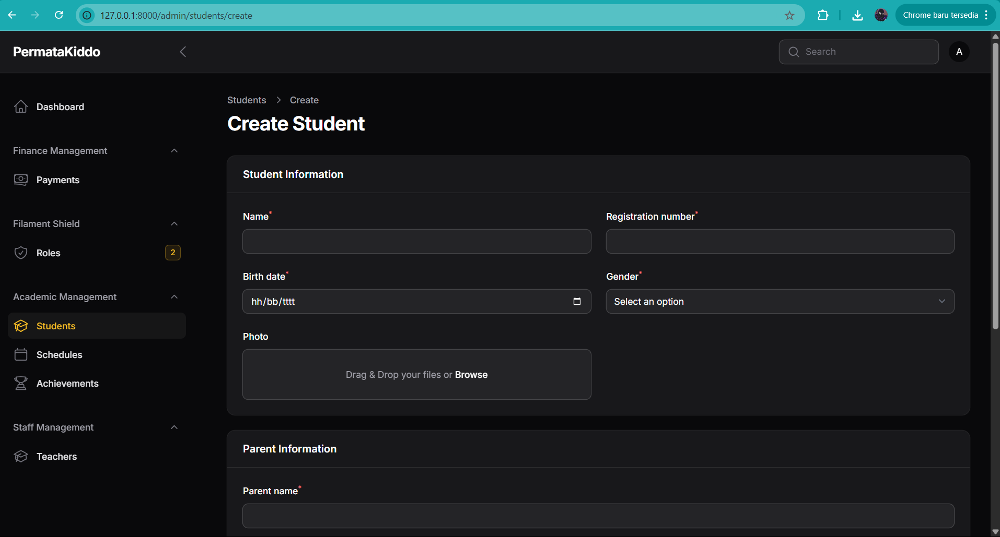

# PermataKiddo - Sistem Informasi Akademik (SIAKAD)



## Deskripsi Proyek

PermataKiddo adalah Sistem Informasi Akademik (SIAKAD) berbasis web yang dirancang khusus untuk lembaga pendidikan anak. Sistem ini menyediakan platform terpadu untuk mengelola data siswa, jadwal pelajaran, pembayaran, dan komunikasi antara pihak sekolah dan orang tua.

## Fitur Utama

- **Multi-level User Authentication**: Admin, guru, dan orang tua dengan hak akses yang berbeda
- **Manajemen Siswa**: Pendaftaran, pengelolaan profil dan data akademik siswa
- **Manajemen Guru**: Pengelolaan data guru, penugasan kelas, dan jadwal mengajar
- **Manajemen Kelas**: Pengaturan kelas, pembagian siswa, dan pengelolaan kurikulum
- **Manajemen Pembayaran**: Sistem pembayaran dengan bukti pembayaran dan status validasi
- **Dashboard Khusus**: Dashboard berbeda untuk admin, guru, dan orang tua
- **Panel Admin**: Admin panel berbasis Filament untuk pengelolaan data master
- **Visualisasi Data**: Grafik dan statistik untuk memantau perkembangan akademik
- **Jadwal Pelajaran**: Manajemen jadwal pelajaran untuk siswa dan guru

## Teknologi yang Digunakan

- **Framework**: Laravel 11
- **Admin Panel**: Filament PHP 3.3
- **PHP**: Versi 8.2
- **Database**: PostgreSQL
- **Frontend**: Blade Templates, Livewire, AlpineJS
- **Autentikasi**: Role Based Access Control (Filament Shield)
- **Package Manager**: Composer (PHP)
- **Styling**: TailwindCSS

## Prasyarat

Sebelum menginstal dan menjalankan aplikasi, pastikan sistem Anda memenuhi persyaratan berikut:

- PHP 8.2 atau lebih tinggi
- Composer
- Node.js dan npm
- PostgreSQL

## Instalasi

1. **Clone repositori**

```bash
git clone https://github.com/PangeranSilaen/PermataKiddo.git
cd PermataKiddo/SIAKAD1
```

2. **Instal dependensi PHP**

```bash
composer install
```

3. **Siapkan file .env**

```bash
cp .env.example .env
php artisan key:generate
```

4. **Konfigurasi database di file .env**

Untuk PostgreSQL:
```
DB_CONNECTION=pgsql
DB_HOST=127.0.0.1
DB_PORT=5432
DB_DATABASE=permatakiddo
DB_USERNAME=root
DB_PASSWORD=
```

5. **Jalankan migrasi dan seeder**

```bash
php artisan migrate --seed
```

6. **Jalankan server**

```bash
php artisan serve
```

Aplikasi akan berjalan di [http://localhost:8000](http://localhost:8000)

## Struktur Proyek

```
SIAKAD1/
├── app/                  # Kode utama aplikasi
│   ├── Console/          # Perintah artisan
│   ├── Filament/         # Konfigurasi admin panel Filament
│   │   ├── Pages/        # Halaman khusus admin
│   │   ├── Resources/    # CRUD resources untuk model
│   │   └── Widgets/      # Widget dashboard
│   ├── Http/             # Controllers, Middleware, dll
│   ├── Models/           # Model database Eloquent
│   └── Policies/         # Kebijakan otorisasi
├── config/               # File konfigurasi aplikasi
├── database/             # Migrasi dan seeder
├── public/               # File yang dapat diakses publik
├── resources/            # View dan assets (js, css)
├── routes/               # Definisi rute aplikasi
└── tests/                # Test suite
```

## Data Login Default

**Administrator:**
- Email: admin@permatakiddo.com
- Password: admin123

**Guru:**
- Email: rizki@permatakiddo.com
- Password: password123

**Orang Tua:**
- Email: ahmad@permatakiddo.com
- Password: password123

## Dokumentasi API

Dokumentasi API tersedia di [APIdocs.md](Laporan/APIdocs.md).

## Diagram Database


## Pengembangan


### Kustomisasi Filament Admin Panel

Untuk mengkustomisasi panel admin, modifikasi file di direktori `app/Filament/`.


## Troubleshooting

### Masalah Umum

1. **Masalah permissions**: Pastikan direktori `storage` dan `bootstrap/cache` writable oleh web server
2. **Error Class not found**: Coba jalankan `composer dump-autoload`
3. **Error database**: Pastikan konfigurasi database di `.env` sudah benar


## Kredit

Dikembangkan oleh Tim PermataKiddo.

